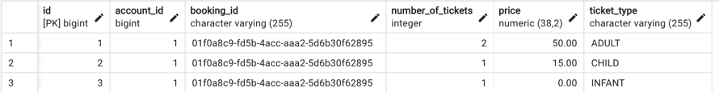

# Ticket Purchase System

## Description

The Ticket Purchase System is an application designed to handle ticket purchasing for various types of events.
This service allows users to purchase tickets of different types (Adult, Child, Infant).

## Features

- Purchase tickets for different categories (Adult, Child, Infant)
- Validate ticket purchase requests
- Integration with payment and seat reservation services
- RESTful API endpoints for easy interaction

## Technologies Used

- Java 17
- Spring Boot
- WebServices(REST)
- Mockito for unit testing
- Maven for dependency management

## Installation

### Prerequisites

- Java 17
- Maven

### Clone the Repository

```bash
git clone https://github.com/dwp/cinema-tickets
cd cinema-tickets
```

## API Endpoints

### Purchase Tickets

- **URL**: `/api/tickets/purchase`
- **Method**: `POST`

#### Request Body

```json
{
  "accountId": 1,
  "ticketTypeRequests": [
    {
      "type": "ADULT",
      "quantity": 2
    },
    {
      "type": "CHILD",
      "quantity": 1
    },
     {
      "type": "INFANT",
      "quantity": 1
    }
  ]
}
```
Response:

200 OK on successful purchase

400 Bad Request with an error message if the request is invalid.

